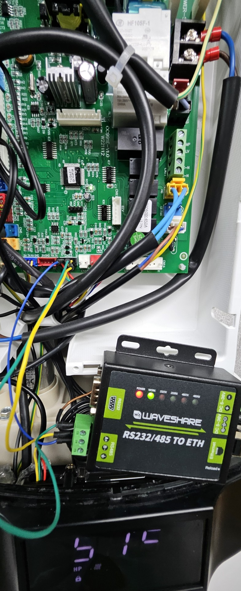
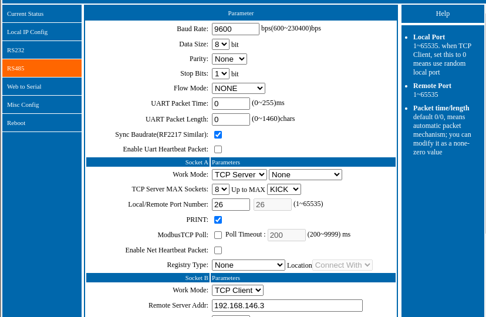

# Daikin-EKHHE
try to receive some information from Daikin EKHHE

to receive some data, i use an Wavesahre RS232/485 ETH Converter. I connect the converter to the CN23 in parallel of the Displaypanel from the Device

i openend the website of the RS485 Converter and use these setting to establish a conncetion

the important part is to use 9600 baud, as TCP Server i use my home automation system named symcon. Now i receive some data...

`27.01.2025, 12:02:23 | RECEIVED [192.168.146.200:49153] | CC 01 14 00 1E 3C 0A 00 07 11 1E FB 03 37 37 37 37 32 3E 3E 07 04 41 07 02 02 00 00 00 03 00 01 01 0A 28 0A 8C 3E 4B 1E 0F 09 19 58 04 FF 00 00 02 02 01 00 00 00 00 00 00 0C 01 20 2B F9 19 0C 5A 32 14 00 01 7F 9F`

`27.01.2025, 12:02:23 | RECEIVED [192.168.146.200:49153] | D2 01 14 00 1E 3C 0A 00 07 11 1E FB 03 37 37 37 37 32 3E 3E 07 04 41 07 02 02 00 00 00 03 00 01 01 0A 28 0A 8C 3E 4B 1E 0F 09 19 58 04 FF 00 00 02 02 01 00 00 00 00 00 0C 01 20 2B F9 19 0C 5A 32 00 01 7F 7F 7F 8F `

`27.01.2025, 12:02:23 | RECEIVED [192.168.146.200:49153] | C1 32 0F 00 28 02 01 08 05 05 09 0C 14 02 05 05 03 04 0A 05 7F 7F 7F 7F 7F 7F 7F 7F 7F 7F 7F 7F 7F 7F 7F 7F 7F 7F 7F 7F 7F 7F 7F 7F 7F FF 7F 7F 7F 7F 96 `

`27.01.2025, 12:02:23 | RECEIVED [192.168.146.200:49153] | D4 32 0F 00 28 02 01 08 05 05 09 0C 14 02 05 05 03 04 0A 05 7F 7F 7F 7F 7F 7F 7F 7F 7F 7F 7F 7F 7F 7F 7F 7F 7F 7F 7F 7F 7F 7F 7F 7F 7F FF 7F 7F 7F 7F A9 `

later i will create some testsettings like Temperature, used digitalport 1-3, eco/auto mode etc..